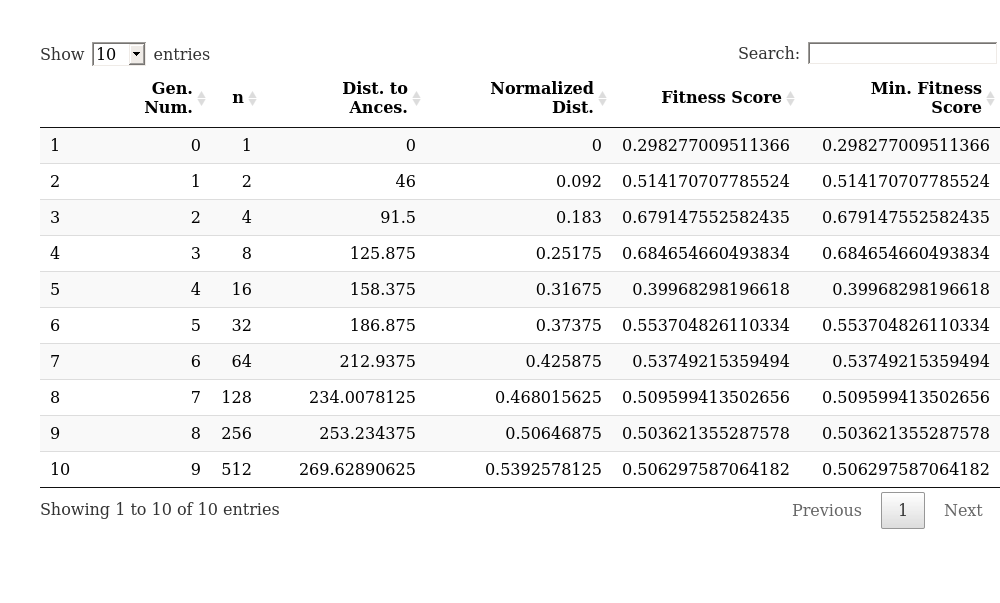
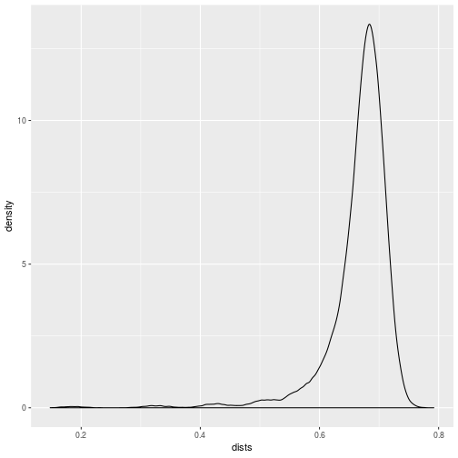

# Basic concepts of quasispecies simulation

## Simple first simulation

Table: Called sim_pop with the following arguments.

<table class="table table-condensed">
 <thead>
  <tr>
   <th style="text-align:right;"> Argument </th>
   <th style="text-align:right;"> Value </th>
  </tr>
 </thead>
<tbody>
  <tr>
   <td style="text-align:right;"> Number of Ancestors </td>
   <td style="text-align:right;"> 1 </td>
  </tr>
  <tr>
   <td style="text-align:right;"> Sequence Length </td>
   <td style="text-align:right;"> 500 </td>
  </tr>
  <tr>
   <td style="text-align:right;"> r0 </td>
   <td style="text-align:right;"> 2 </td>
  </tr>
  <tr>
   <td style="text-align:right;"> Number of Generations </td>
   <td style="text-align:right;"> 9 </td>
  </tr>
  <tr>
   <td style="text-align:right;"> Minimum Population Size </td>
   <td style="text-align:right;"> Inf </td>
  </tr>
  <tr>
   <td style="text-align:right;"> Mutator Function </td>
   <td style="text-align:right;"> mutator_uniform_fun </td>
  </tr>
  <tr>
   <td style="text-align:right;"> Mutator: mu </td>
   <td style="text-align:right;"> 0.1 </td>
  </tr>
  <tr>
   <td style="text-align:right;"> Fitness Evaluator </td>
   <td style="text-align:right;"> fitness_evaluator_uniform_fun </td>
  </tr>
  <tr>
   <td style="text-align:right;"> Additional Fitness Evaluator Arguments </td>
   <td style="text-align:right;"> None </td>
  </tr>
</tbody>
</table>

Table: Individuals per generation and the average distance to the original ancestor for the generation.

<table class="table table-condensed">
 <thead>
  <tr>
   <th style="text-align:right;"> Gen. Num. </th>
   <th style="text-align:right;"> n </th>
   <th style="text-align:right;"> Dist. to Ances. </th>
   <th style="text-align:right;"> Normalized Dist. </th>
   <th style="text-align:right;"> Fitness Score </th>
   <th style="text-align:right;"> Min. Fitness Score </th>
  </tr>
 </thead>
<tbody>
  <tr>
   <td style="text-align:right;"> 0 </td>
   <td style="text-align:right;"> 1 </td>
   <td style="text-align:right;"> 0.0000 </td>
   <td style="text-align:right;"> 0.0000000 </td>
   <td style="text-align:right;"> 0.2982770 </td>
   <td style="text-align:right;"> 0.2982770 </td>
  </tr>
  <tr>
   <td style="text-align:right;"> 1 </td>
   <td style="text-align:right;"> 2 </td>
   <td style="text-align:right;"> 46.0000 </td>
   <td style="text-align:right;"> 0.0920000 </td>
   <td style="text-align:right;"> 0.5141707 </td>
   <td style="text-align:right;"> 0.5141707 </td>
  </tr>
  <tr>
   <td style="text-align:right;"> 2 </td>
   <td style="text-align:right;"> 4 </td>
   <td style="text-align:right;"> 91.5000 </td>
   <td style="text-align:right;"> 0.1830000 </td>
   <td style="text-align:right;"> 0.6791476 </td>
   <td style="text-align:right;"> 0.6791476 </td>
  </tr>
  <tr>
   <td style="text-align:right;"> 3 </td>
   <td style="text-align:right;"> 8 </td>
   <td style="text-align:right;"> 125.8750 </td>
   <td style="text-align:right;"> 0.2517500 </td>
   <td style="text-align:right;"> 0.6846547 </td>
   <td style="text-align:right;"> 0.6846547 </td>
  </tr>
  <tr>
   <td style="text-align:right;"> 4 </td>
   <td style="text-align:right;"> 16 </td>
   <td style="text-align:right;"> 158.3750 </td>
   <td style="text-align:right;"> 0.3167500 </td>
   <td style="text-align:right;"> 0.3996830 </td>
   <td style="text-align:right;"> 0.3996830 </td>
  </tr>
  <tr>
   <td style="text-align:right;"> 5 </td>
   <td style="text-align:right;"> 32 </td>
   <td style="text-align:right;"> 186.8750 </td>
   <td style="text-align:right;"> 0.3737500 </td>
   <td style="text-align:right;"> 0.5537048 </td>
   <td style="text-align:right;"> 0.5537048 </td>
  </tr>
  <tr>
   <td style="text-align:right;"> 6 </td>
   <td style="text-align:right;"> 64 </td>
   <td style="text-align:right;"> 212.9375 </td>
   <td style="text-align:right;"> 0.4258750 </td>
   <td style="text-align:right;"> 0.5374922 </td>
   <td style="text-align:right;"> 0.5374922 </td>
  </tr>
  <tr>
   <td style="text-align:right;"> 7 </td>
   <td style="text-align:right;"> 128 </td>
   <td style="text-align:right;"> 234.0078 </td>
   <td style="text-align:right;"> 0.4680156 </td>
   <td style="text-align:right;"> 0.5095994 </td>
   <td style="text-align:right;"> 0.5095994 </td>
  </tr>
  <tr>
   <td style="text-align:right;"> 8 </td>
   <td style="text-align:right;"> 256 </td>
   <td style="text-align:right;"> 253.2344 </td>
   <td style="text-align:right;"> 0.5064688 </td>
   <td style="text-align:right;"> 0.5036214 </td>
   <td style="text-align:right;"> 0.5036214 </td>
  </tr>
  <tr>
   <td style="text-align:right;"> 9 </td>
   <td style="text-align:right;"> 512 </td>
   <td style="text-align:right;"> 269.6289 </td>
   <td style="text-align:right;"> 0.5392578 </td>
   <td style="text-align:right;"> 0.5062976 </td>
   <td style="text-align:right;"> 0.5062976 </td>
  </tr>
</tbody>
</table>

Table: Individuals per generation and the average distance to the original ancestor for the generation.

<table class="table table-condensed">
 <thead>
  <tr>
   <th style="text-align:center;"> Gen. Num. </th>
   <th style="text-align:center;"> n </th>
   <th style="text-align:center;"> Dist. to Ances. </th>
   <th style="text-align:center;"> Normalized Dist. </th>
   <th style="text-align:center;"> Fitness Score </th>
   <th style="text-align:center;"> Min. Fitness Score </th>
  </tr>
 </thead>
<tbody>
  <tr>
   <td style="text-align:center;"> 0 </td>
   <td style="text-align:center;"> 1 </td>
   <td style="text-align:center;"> 0.0000 </td>
   <td style="text-align:center;"> 0.0000000 </td>
   <td style="text-align:center;"> 0.2982770 </td>
   <td style="text-align:center;"> 0.2982770 </td>
  </tr>
  <tr>
   <td style="text-align:center;"> 1 </td>
   <td style="text-align:center;"> 2 </td>
   <td style="text-align:center;"> 46.0000 </td>
   <td style="text-align:center;"> 0.0920000 </td>
   <td style="text-align:center;"> 0.5141707 </td>
   <td style="text-align:center;"> 0.5141707 </td>
  </tr>
  <tr>
   <td style="text-align:center;"> 2 </td>
   <td style="text-align:center;"> 4 </td>
   <td style="text-align:center;"> 91.5000 </td>
   <td style="text-align:center;"> 0.1830000 </td>
   <td style="text-align:center;"> 0.6791476 </td>
   <td style="text-align:center;"> 0.6791476 </td>
  </tr>
  <tr>
   <td style="text-align:center;"> 3 </td>
   <td style="text-align:center;"> 8 </td>
   <td style="text-align:center;"> 125.8750 </td>
   <td style="text-align:center;"> 0.2517500 </td>
   <td style="text-align:center;"> 0.6846547 </td>
   <td style="text-align:center;"> 0.6846547 </td>
  </tr>
  <tr>
   <td style="text-align:center;"> 4 </td>
   <td style="text-align:center;"> 16 </td>
   <td style="text-align:center;"> 158.3750 </td>
   <td style="text-align:center;"> 0.3167500 </td>
   <td style="text-align:center;"> 0.3996830 </td>
   <td style="text-align:center;"> 0.3996830 </td>
  </tr>
  <tr>
   <td style="text-align:center;"> 5 </td>
   <td style="text-align:center;"> 32 </td>
   <td style="text-align:center;"> 186.8750 </td>
   <td style="text-align:center;"> 0.3737500 </td>
   <td style="text-align:center;"> 0.5537048 </td>
   <td style="text-align:center;"> 0.5537048 </td>
  </tr>
  <tr>
   <td style="text-align:center;"> 6 </td>
   <td style="text-align:center;"> 64 </td>
   <td style="text-align:center;"> 212.9375 </td>
   <td style="text-align:center;"> 0.4258750 </td>
   <td style="text-align:center;"> 0.5374922 </td>
   <td style="text-align:center;"> 0.5374922 </td>
  </tr>
  <tr>
   <td style="text-align:center;"> 7 </td>
   <td style="text-align:center;"> 128 </td>
   <td style="text-align:center;"> 234.0078 </td>
   <td style="text-align:center;"> 0.4680156 </td>
   <td style="text-align:center;"> 0.5095994 </td>
   <td style="text-align:center;"> 0.5095994 </td>
  </tr>
  <tr>
   <td style="text-align:center;"> 8 </td>
   <td style="text-align:center;"> 256 </td>
   <td style="text-align:center;"> 253.2344 </td>
   <td style="text-align:center;"> 0.5064688 </td>
   <td style="text-align:center;"> 0.5036214 </td>
   <td style="text-align:center;"> 0.5036214 </td>
  </tr>
  <tr>
   <td style="text-align:center;"> 9 </td>
   <td style="text-align:center;"> 512 </td>
   <td style="text-align:center;"> 269.6289 </td>
   <td style="text-align:center;"> 0.5392578 </td>
   <td style="text-align:center;"> 0.5062976 </td>
   <td style="text-align:center;"> 0.5062976 </td>
  </tr>
</tbody>
</table>

Table: Individuals per generation and the average distance to the original ancestor for the generation.

### Looking at only the last generation now

The average pairwise HD is 333.24 and normalized by the length of the sequence it is 0.666.

Figure: Density plot of the pariwise distances in the last generation.

Table: The Deciles of the pairwise HDs.

<table class="table table-condensed">
 <thead>
  <tr>
   <th style="text-align:center;"> Decile </th>
   <th style="text-align:center;"> Value </th>
  </tr>
 </thead>
<tbody>
  <tr>
   <td style="text-align:center;"> 0%   </td>
   <td style="text-align:center;"> 0.148 </td>
  </tr>
  <tr>
   <td style="text-align:center;"> 10%  </td>
   <td style="text-align:center;"> 0.614 </td>
  </tr>
  <tr>
   <td style="text-align:center;"> 20%  </td>
   <td style="text-align:center;"> 0.644 </td>
  </tr>
  <tr>
   <td style="text-align:center;"> 30%  </td>
   <td style="text-align:center;"> 0.660 </td>
  </tr>
  <tr>
   <td style="text-align:center;"> 40%  </td>
   <td style="text-align:center;"> 0.670 </td>
  </tr>
  <tr>
   <td style="text-align:center;"> 50%  </td>
   <td style="text-align:center;"> 0.678 </td>
  </tr>
  <tr>
   <td style="text-align:center;"> 60%  </td>
   <td style="text-align:center;"> 0.686 </td>
  </tr>
  <tr>
   <td style="text-align:center;"> 70%  </td>
   <td style="text-align:center;"> 0.692 </td>
  </tr>
  <tr>
   <td style="text-align:center;"> 80%  </td>
   <td style="text-align:center;"> 0.702 </td>
  </tr>
  <tr>
   <td style="text-align:center;"> 90%  </td>
   <td style="text-align:center;"> 0.712 </td>
  </tr>
  <tr>
   <td style="text-align:center;"> 100% </td>
   <td style="text-align:center;"> 0.792 </td>
  </tr>
</tbody>
</table>
